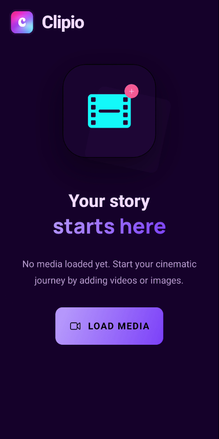
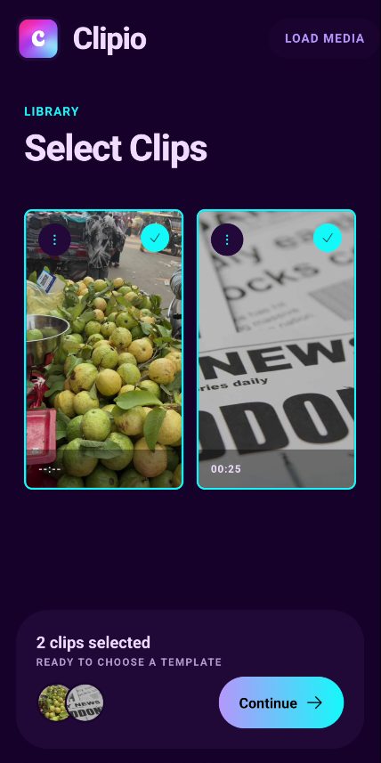
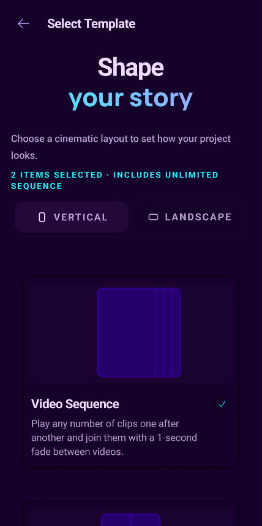
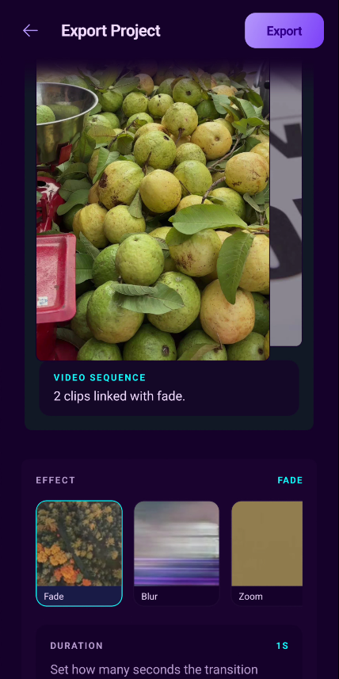

# Clipio

<p align="center">
  
</p>

Clipio is a template-based video editor built with Expo Router, React Native, and TypeScript. It lets you pick videos and images from the device library, arrange them into ready-made vertical or landscape layouts, preview the composition, trim clips, and export the final video on Android with a native FFmpeg pipeline.

## App Features

- **Media library import**: select videos and images from the device gallery with `expo-image-picker`.
- **Clip library**: review imported media in a thumbnail grid, select the items that should be used in a project, remove items, open videos for playback, and trim video clips before building the edit.
- **Template selection**: choose only from templates that can fit the current selection, with separate vertical and landscape filters.
- **Vertical and landscape output**: build projects for 9:16 social video or 16:9 landscape video.
- **Sequence templates**: place any number of clips one after another with configurable transition timing and visual effects.
- **Grid templates**: create 2x2 compositions with four media items.
- **Focus templates**: create layouts with one primary clip and three secondary clips, available in both portrait and landscape formats.
- **Image support**: include still images in video projects and configure their duration in the editor.
- **Clip ordering**: reorder selected media directly from the template editor.
- **Style controls**: adjust template background color, spacing, and corner radius.
- **Audio source selection**: choose which video clip provides the project audio when the template supports multiple clips.
- **Live preview**: preview the current project in React Native before exporting.
- **Native Android export**: export the project through `FFmpegExportModule`, save the rendered video to the device gallery, and open a preview of the exported file.
- **Localized UI**: user-facing strings are managed with Lingui.






## Available Templates

| Template                 | Orientation    | Media count | Description                                                   |
| ------------------------ | -------------- | ----------: | ------------------------------------------------------------- |
| Video Sequence           | Vertical 9:16  |   Unlimited | Plays media one after another with transitions.               |
| Video Sequence Landscape | Landscape 16:9 |   Unlimited | Landscape sequence for any number of clips.                   |
| 2x2 Grid                 | Vertical 9:16  |           4 | Four equal cells in a portrait composition.                   |
| 2x2 Grid Landscape       | Landscape 16:9 |           4 | Four equal cells in a landscape composition.                  |
| Focus Layout             | Vertical 9:16  |           4 | One large top clip with three supporting clips below.         |
| Focus Layout Landscape   | Landscape 16:9 |           4 | One large left clip with three supporting clips on the right. |

## Project Structure

- `app/`: Expo Router screens, including template selection, template editing, trimming, and export preview.
- `components/`: shared UI components grouped by feature area.
- `features/templates/`: template registry, template metadata, and template icons.
- `features/video-editor/`: project domain model, preview engine, export contracts, and FFmpeg command generation.
- `services/`: app-level services for export and trimming.
- `stores/`: editor and media selection state.
- `types/`: shared TypeScript types for media, templates, and editor data.
- `android/`: native Android project, including custom export and trim modules.
- `scripts/ffmpeg/`: Android FFmpeg build and verification scripts.

## Requirements

- Node.js version from `.nvmrc` (`nvm use` is recommended).
- Android Studio and Android SDK/NDK for native Android builds.
- Expo development builds. This project does not run in Expo Go because it includes custom native Android modules.

## Development

Install dependencies:

```bash
npm install
```

Start the Expo development server:

```bash
npm run start
```

Build and install the Android development client:

```bash
npm run android
```

Run the web target:

```bash
npm run web
```

## Validation

Run the standard checks before shipping changes:

```bash
npm run lint
npx tsc --noEmit
```

Verify that Android FFmpeg binaries are present:

```bash
npm run ffmpeg:doctor
```

## Android FFmpeg Export

Clipio exports Android videos with a native `FFmpegExportModule`. The app expects one executable FFmpeg binary per Android ABI:

```text
android/app/src/main/jniLibs/arm64-v8a/libffmpeg.so
android/app/src/main/jniLibs/armeabi-v7a/libffmpeg.so
android/app/src/main/jniLibs/x86_64/libffmpeg.so
```

Build or refresh the binaries with:

```bash
npm run ffmpeg:build:android
```

The Gradle build verifies that these binaries exist before packaging the app. EAS builds also run `eas-build-post-install`, which checks the binaries and builds FFmpeg when needed.

More details are available in `docs/ffmpeg-android-setup.md`.

## Local Android APK

Build a release APK locally:

```bash
cd android
./gradlew :app:assembleRelease
```

The generated APK is written to:

```text
android/app/build/outputs/apk/release/app-release.apk
```

## EAS Build

Build an internal Android APK with the configured preview profile:

```bash
npm run build:local
```

Or run EAS directly:

```bash
eas build --platform android --profile preview --local
```
